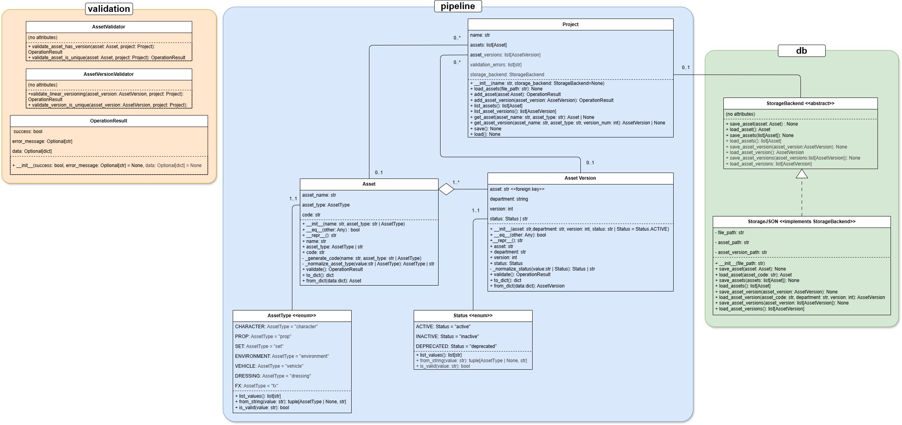

# LAIKA Asset Validation & Registration Service

A mini animation pipeline asset validation and registration service built as a Python take-home challenge. 

## Table of Contents

- [Quick Start](#quick-start)
- [Installation](#installation)
- [Data Model](#data-model)
- [Architecture](#architecture)
- [Project Structure](#project-structure)
- [API Usage](#api-usage)
- [CLI Usage](#cli-usage)
- [Testing](#testing)
- [Storage Backends](#storage-backends)
- [Design Notes](#design-notes)

## Quick Start

```bash
# Install dependencies
poetry install

# Run demo
poetry run run_demo

# Run tests
poetry run run_tests

# Run API example
poetry run run_api_example
```

## Installation

### Requirements

- Python 3.9+
- Poetry (dependency manager)

### Setup

```bash
# Install Poetry
pip install poetry

# Install project dependencies
poetry install

# Verify installation
python -m laika_pipeline --help
```

This generates a `poetry.lock` file ensuring reproducible builds.

## Data Model

### Core Entities

**Asset** — Uniquely identified by `(name, type)` pairs.
- `name`: str — Asset name (required, stripped of whitespace)
- `type`: AssetType — One of: `character`, `prop`, `set`, `environment`, `vehicle`, `dressing`, `fx`
- `code`: str — Generated unique identifier (e.g., `hero_character`)

**AssetVersion** — Versioned artifacts tied to assets by department.
- `asset`: str — Asset code (foreign key)
- `department`: str — Department responsible (one of: `modeling`, `texturing`, `rigging`, `animation`, `cfx`, `fx`)
- `version`: int — Version number (≥ 1, must increment linearly with no gaps)
- `status`: Status — Either `active` or `inactive`

### Uniqueness Constraints

- **Asset uniqueness**: No two assets can share the same `(name, type)` pair
- **Version uniqueness**: No two versions can share the same `(asset_code, department, version)` tuple
- **Version continuity**: Asset versions must increment by 1 with no gaps (e.g., versions 1, 2, 3 — not 1, 3, 5)

### Example JSON Data

```json
[
  {
    "asset": {
      "name": "hero",
      "type": "character"
    },
    "department": "modeling",
    "version": 1,
    "status": "active"
  },
  {
    "asset": {
      "name": "hero",
      "type": "character"
    },
    "department": "texturing",
    "version": 1,
    "status": "active"
  }
]
```

## Architecture



The system is organized into three main layers:

### 1. **Pipeline Layer** (`pipeline/`)

Core domain models representing asset concepts.

- `Asset` — Asset metadata container with code generation
- `AssetVersion` — Versioned asset artifact with department tracking
- `Project` — Orchestrates assets, versions, validation, and persistence
- `AssetType` — Enum of allowed asset types
- `Status` — Enum for version status (`active`/`inactive`)

### 2. **Storage/Database Layer** (`db/`)

Abstract persistence interface with pluggable implementations.

- `StorageBackend` — Abstract interface for asset/version persistence
- `StorageJSON` — File-based JSON storage (human-readable, suitable for prototyping)

### 3. **Validation Layer** (`validation/`)

Extensible, composable validation rules applied during asset/version operations.

- `Validator` — Abstract base for all validators
- `OperationResult` — Structured validation result (success flag, data, errors)
- Individual validators check name, type, department, version, status, uniqueness

Validators are run during `add_asset()` and `add_asset_version()` operations; failures are logged but don't halt processing.

## Project Structure

### Folder Descriptions

- **db/** — Storage backends for assets and versions; pluggable interface allows SQLite, JSON, in-memory, etc.
- **lib/** — General utility functions (JSON loading, helpers)
- **pipeline/** — Core domain objects (Asset, AssetVersion, Project) and enums
- **test/** — Comprehensive unit tests covering all public API functions; run with `run_tests` command
- **validation/** — Result types and validation logic (local per-object + contextual in Project)
- **example/** — Demonstration of API usage patterns

## API Usage

### Module-Level API

The `api.py` module provides the pipeline interface:

```python
from laika_pipeline.api import initialize, add_asset, list_assets, save
from laika_pipeline.pipeline.asset import Asset
from laika_pipeline.db.storage_json import StorageJSON

# Initialize with optional storage backend
storage = StorageJSON('path/to/storage')
initialize(name="My Project", storage_backend=storage)

# Add assets
asset = Asset("hero", "character")
result = add_asset(asset)
print(f"Asset added: {result['asset_code']}")

# Query assets
all_assets = list_assets()
for asset in all_assets:
    print(f"{asset.name} ({asset.asset_type.value})")

# Persist to storage
save_result = save()
if save_result['success']:
    print("Saved!")
```

### Key Functions

- `initialize(name, storage_backend)` — Set up the project
- `load_assets(file_path)` — Load assets/versions from JSON file
- `add_asset(asset)` — Add single asset
- `add_asset_version(version)` — Add single version
- `list_assets()` — Retrieve all assets
- `list_asset_versions(asset_name, asset_type)` — Retrieve versions for an asset
- `get_asset(name, type)` — Fetch specific asset
- `get_asset_version(name, type, version)` — Fetch specific version
- `save()` / `load()` — Persist/restore from storage backend
- `get_validation_errors()` — Retrieve validation errors from session
- `clear()` — Reset API state
- `get_project()` — Access underlying Project instance (advanced)

See [example/](example/) for more usage patterns.

## CLI Usage

Launch the command-line interface:

```bash
python -m laika_pipeline -p "Project Name" -jp "path/to/assets/folder"
```

**Example:**

```bash
python -m laika_pipeline -p "Test Project" -jp "sample_data/test_project"
```

**Notes:**
- The folder path must exist beforehand
- Assets are loaded from `assets/` and versions from `asset_versions/` subdirectories
- Results are printed to console

## Testing

### Running Tests

```bash
# Run all tests
poetry run run_tests

# Or directly
python -m pytest laika_pipeline/test -v
```

### Test Structure

Tests are organized into separate `test_*.py` files in the `test/` directory:

- `test_initialize.py` — Initialization and setup
- `test_load_assets.py` — Loading from JSON files
- `test_add_asset.py` — Asset creation
- `test_add_asset_version.py` — Version management
- `test_list_*.py` — Querying operations
- `test_get_*.py` — Retrieval functions
- `test_save_load.py` — Persistence
- `test_api_scenarios.py` — Integration workflows
- Others — Utility functions, edge cases

Run the test discovery:

```bash
cd laika_pipeline/test
python test_api.py
```

## Storage Backends

### JSON Storage

Default file-based storage using JSON for human readability.

```python
from laika_pipeline.db.storage_json import StorageJSON
from laika_pipeline.api import initialize

storage = StorageJSON("path/to/storage/dir")
initialize(storage_backend=storage)
```

### In-Memory Storage

If no storage backend is provided, assets are kept in memory only (useful for testing).

```python
from laika_pipeline.api import initialize

initialize()  # In-memory storage
```

## Design Notes

### Architecture Decisions

**Validation Strategy**
- Two-tier validation: local (per-object) and contextual (project-level)
  - Local: `Asset.validate()` and `AssetVersion.validate()` check individual field validity
  - Contextual: `Project` validates uniqueness constraints and version continuity
- Validators return `OperationResult` objects; failures don't halt processing

**Storage Abstraction**
- `StorageBackend` ABC allows pluggable implementations (JSON, SQLite, in-memory)
- Projects own a storage backend; persistence is explicit via `save()`/`load()`

**Asset Code Generation**
- Assets are identified by `code` derived from `{name}_{type}` (e.g., `hero_character`)
- Codes are immutable and serve as foreign keys for versions

### Known Limitations & Future Improvements

- Currently uses lists for asset/version storage; consider dictionaries for O(1) lookups
- Validation logic could be extended with rule engines or DSLs
- No built-in pagination for large datasets
- CLI could support batch operations and formatted output (CSV, XML)
- Consider SQLite backend for production durability

## Notes

- Challenge admitedly completed in  more than 6 hours
- Code tags (`# NOTE`) throughout explain design choices and tradeoffs
- I struggled a bit with the validation logic: landed on local + contextual split for flexibility
- AI was used as a tool for generating unittests, and improving this README.

